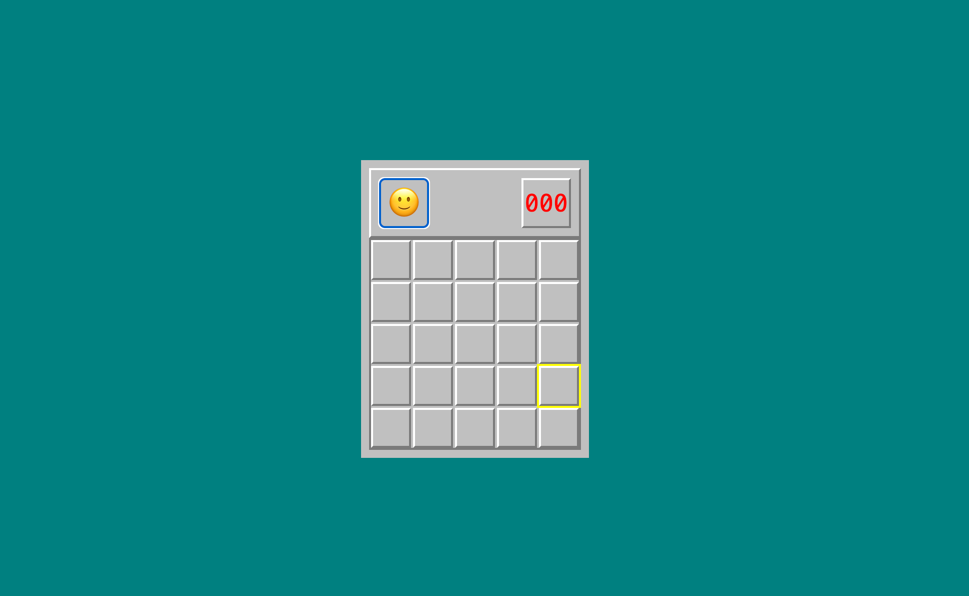

# Minesweeper Game

[](https://reactjs.org/)
[](https://www.typescriptlang.org/)
[](https://github.com/hamidreza8968/minesweeper-schneider-interview/actions)

A modern **Minesweeper game** built with **React** and **TypeScript**, demonstrating clean architecture, comprehensive testing, and advanced React patterns.

---

## ✨ Features

- ✅ **Dynamic Board Generation** – 5x5 grid with configurable bomb density (20%)
- 🎯 **Smart Cell Revelation** – Flood-fill algorithm for revealing empty areas
- 🚩 **Flag System** – Right-click or keyboard shortcut to mark mines
- ⏱️ **Game Timer** – Tracks elapsed time with pause on game end
- ⌨️ **Keyboard Navigation** – Full accessibility with arrow keys, Enter, and F
- 💾 **State Persistence** – Resume your game after page refresh
- 🧪 **Comprehensive Testing** – Unit tests with Jest and React Testing Library
- 📦 **TypeScript** – Full type safety with custom type definitions

---

## 🛠️ Tech Stack

- **React** (v19.2.4) with **TypeScript** (v4.9.5)
- **React Context API** for state management
- **Custom Hooks** (useTimer, useKeyboardNavigation)
- **Jest** & **React Testing Library** for testing
- **ESLint** with TypeScript, React, and accessibility plugins
- **LocalStorage** for state persistence

---

## 🚀 Getting Started

### Installation

```bash
# Clone the repository
git clone https://github.com/hamidreza8968/minesweeper-schneider-interview.git
cd minesweeper-schneider-interview

# Install dependencies
npm install

# Start the development server
npm start
```

The app will open at [http://localhost:3000](http://localhost:3000)

### Available Scripts

- **`npm start`** – Run in development mode
- **`npm test`** – Run tests in watch mode
- **`npm run build`** – Build for production
- **`npm run lint`** – Check code for linting errors
- **`npm run lint:fix`** – Automatically fix linting errors
- **`npm test -- --coverage --watchAll=false`** – Generate test coverage report

---

## 🎲 How to Play

1. **Click** (or press **Enter**) on a cell to reveal it
2. **Right-click** (or press **F**) to flag suspected mines
3. **Arrow keys** navigate between cells
4. Reveal all non-mine cells to win!

**Game Details:**
- 5x5 grid with 5 randomly placed mines (20% density)
- Numbers show adjacent mine count
- Cells with 0 adjacent mines auto-reveal surrounding cells
- Timer starts on first reveal

---

## 📁 Project Structure

```
src/
├── app/                    # Main application
│   └── App.tsx            # Root component (5x5, 20% bomb rate)
├── components/            # UI components
│   ├── Board/            # Game board and cells
│   ├── ResetButton/      # Game reset functionality
│   └── Timer/            # Elapsed time display
├── context/              # React Context
│   └── BoardContext.tsx  # Global game state
├── hooks/                # Custom hooks
│   ├── useTimer.ts       # Timer logic
│   └── useKeyboardNavigation.ts  # Keyboard controls
├── utils/                # Core logic
│   ├── generateBoard.ts  # Board generation algorithm
│   ├── gameLogic.ts      # Reveal, flag, win/loss detection
│   └── storage.ts        # LocalStorage management
├── types/                # TypeScript definitions
└── tests/                # Unit tests
```

---

## 🏛️ Architecture Highlights

### State Management
- **React Context API** for centralized game state
- Clean separation between UI and business logic
- All game logic in pure, testable utility functions

### Custom Hooks
- **`useTimer`** – Manages game timer with start/pause
- **`useKeyboardNavigation`** – Handles arrow key navigation and action triggers

### Type Safety
Full TypeScript coverage with custom interfaces:

```typescript
interface Cell {
  isMine: boolean;
  isRevealed: boolean;
  isFlagged: boolean;
  adjacentMines: number;
}

type GameStatusType = "notPlaying" | "playing" | "lost" | "won";
```

---

## 🧪 Testing

The project includes comprehensive unit tests:

```bash
npm test
```

**Test Coverage:**
- Board generation logic and mine placement
- Cell reveal and flood-fill algorithm
- Flag toggle functionality
- Win/loss condition detection
- Context state management

---

## 🔄 Continuous Integration

This project uses **GitHub Actions** for automated testing and quality checks.

### CI Workflow
Runs automatically on every push and pull request to `main`, `master`, or `develop`:

- ✅ **Multi-version testing** - Tests on Node.js 16.x, 18.x, and 20.x
- 🔍 **ESLint** - Enforces code quality standards
- 📘 **TypeScript check** - Validates type safety
- 🧪 **Unit tests** - Runs full test suite with coverage
- 🏗️ **Production build** - Ensures the app builds successfully

The workflow ensures code quality and prevents breaking changes before they're merged.

---

## 📧 Contact

**Hamid Reza** – [GitHub Profile](https://github.com/hamidreza8968)

---

---

## 📸 Screenshot



Made with ❤️ using React and TypeScript
